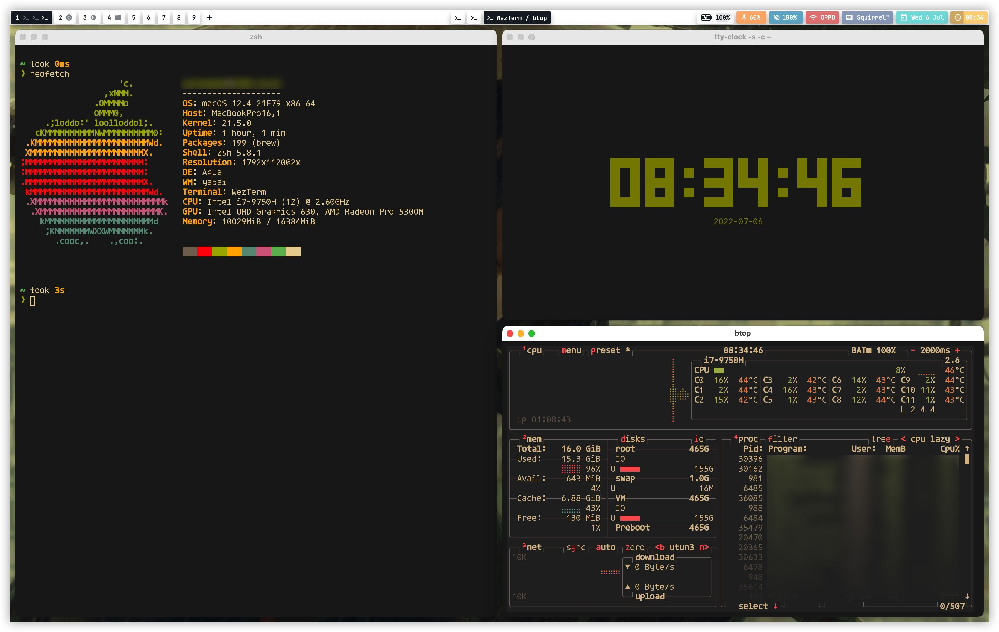

# DotFiles

The dotfiles are common used in my work and life.

## Vim & Neovim

I'm a neovim & vim user from 2021. It really changed my promgramming life.

Here are some of my neovim & vim config introduction

### Neovim

Neovim must 0.8+

If you want to use my configs you must do the following staffs

#### Requirement of experience

- linux/macos environment. the dotfiles are not tested on windows
- c compile toolchains in your promgramming environment - it is for treesitter
- for telescope, charmming fuzzy finder
  - [fd](https://github.com/sharkdp/fd): better find
  - [ripgrep](https://github.com/BurntSushi/ripgrep): better grep
- of course the neovim 0.8+
- [packer](https://github.com/wbthomason/packer.nvim) the plugin management tool

#### Quick start

```sh
$ git clone https://github.com/azzgo/dotfiles
$ ln -sf $PWD/dotfiles/nvim ~/.config/nvim      # linux or osx environment required
$ nvim -c ":PackerSync"
```

### vimrc - for simple edit environment

I also have a vim configs for some simple or old environment, there are not much plugin i used. you can starts with:

```sh
$ git clone https://github.com/azzgo/dotfiles
$ ln -sf $PWD/dotfiles/vim ~/.vim                 # linux or osx environment required
$ ln -sf $PWD/dotfiles/vim/vimrc ~/.vimrc
$ vim -c ":PlugInstall"
```

### ideavimrc

en, only for java, because java sucks in vim

## Other dotfils

### emacs

Mainly to do some note taking work and daily work track

If you want to use it.

Make sure do some of the following:

```sh
$ git clone https://github.com/azzgo/dotfiles
$ mkdir ~/.emacs.d
$ ln -sf $ $PWD/dotfils/emacs/init.el ~/.emacs.d/init.el
$ ln -sf $ $PWD/dotfils/emacs/lisp ~/.emacs.d/lisp
```

And add a `init-local.el` file in ~/.emacs.d/lisp 

You should make the content init like this:

```
;; you can add your local config above this line
(provide 'init-local)
```

### wezterm

A amazing gui based terminal i liked

### yabei & skhd

I use the yabai and skhd is to provide the tilling wm experience.

For the additional, I use [Simple Bar](https://github.com/Jean-Tinland/simple-bar) get beauity bar in Macos, it is worth.

my porn



### shells

Support zsh and bash

In your shellrc file, source my shell configs like this:

```sh
# ~/.bashrc

source ~/dotfiles/shell/bashrc

# add your unique config after source
```

oh I use starship prompt which it also keep in the repo. Tt's realy nice. for performance i disable some git function, but keep others defalut.

